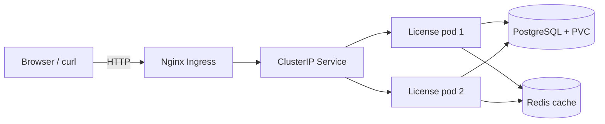

# DevOps Lab 3 — Kubernetes orchestration

The License Service is deployed to a local Minikube cluster as two interchangeable
application pods behind a ClusterIP Service and Nginx Ingress. PostgreSQL stores
business data on a persistent volume; Redis contains rebuildable shared cache data.
The deployment uses immutable GHCR image tags produced by DevOps Lab 2.

## Architecture and repository layout

The diagram source is [architecture-kubernetes.mmd](architecture-kubernetes.mmd).



Every Kubernetes object has its own manifest under `k8s/`; `kustomization.yaml`
combines them into a one-command deployment. The namespace is `mtgmods-labs`.

| Object | Purpose |
|---|---|
| `Deployment/license-service` | two API replicas, RollingUpdate, probes and resource limits |
| `Service/license-service` | stable load-balanced ClusterIP for application pods |
| `Ingress/license-service` | `http://mtgmods.local` entry point through Nginx |
| `Deployment/license-postgres` + PVC | primary persistent business state |
| `Job/license-db-init` | deterministic database schema initialization |
| `Deployment/redis` | shared, rebuildable public-statistics cache |
| `ConfigMap/license-config` | non-sensitive runtime configuration |
| `Secret/license-secrets` | isolated lab credentials and connection strings |

The committed Secret contains only non-production credentials for the disposable
local cluster. Real credentials must be supplied outside Git.

## Prerequisites and cold deployment

Install Docker Desktop, `kubectl` and Minikube. The commands below use the Docker
driver and enable the required cluster add-ons:

```powershell
minikube start --driver=docker --cpus=4 --memory=6144
minikube addons enable metrics-server
minikube addons enable ingress
kubectl wait --namespace ingress-nginx --for=condition=available deployment/ingress-nginx-controller --timeout=180s
kubectl apply -k k8s
kubectl wait --for=condition=complete job/license-db-init -n mtgmods-labs --timeout=180s
kubectl rollout status deployment/license-service -n mtgmods-labs --timeout=180s
```

One `kubectl apply -k k8s` command creates the namespace and the complete stack.
The schema Job may finish before application images have been pulled; the API
pods wait for the schema and cannot accept traffic prematurely.

Inspect the deployed objects and replica state:

```powershell
kubectl get pods,deployments,replicasets,services,ingresses,pvc -n mtgmods-labs
kubectl describe deployment license-service -n mtgmods-labs
kubectl top pods -n mtgmods-labs
```

With Docker Desktop on Windows, keep a second elevated terminal running the
Minikube tunnel. Then open Swagger or check health without editing the hosts file:

```powershell
minikube tunnel
curl.exe --resolve "mtgmods.local:80:127.0.0.1" http://mtgmods.local/health
start "http://mtgmods.local/docs" # after mapping mtgmods.local to 127.0.0.1 in hosts
```

The response contains `X-Instance-ID`, which identifies the pod that handled it.

## Configuration evidence

`ConfigMap` has multiple non-sensitive values. `Secret` supplies credentials via
environment variables without printing their contents during the demonstration:

```powershell
kubectl get configmap license-config -n mtgmods-labs -o yaml
kubectl exec -n mtgmods-labs deploy/license-service -- printenv APP_VERSION REDIS_URL
kubectl exec -n mtgmods-labs deploy/license-service -- python -c "import os; print('JWT secret injected:', bool(os.getenv('JWT_SECRET')))"
```

## Lifecycle scenarios

### Self-healing and manual scaling

Delete one API pod and watch the Deployment restore the requested replica count:

```powershell
$pod = kubectl get pod -n mtgmods-labs -l app=license-service -o jsonpath='{.items[0].metadata.name}'
kubectl delete pod $pod -n mtgmods-labs
kubectl get pods -n mtgmods-labs -l app=license-service --watch
```

Scale horizontally and return to the declared baseline:

```powershell
kubectl scale deployment/license-service -n mtgmods-labs --replicas=3
kubectl rollout status deployment/license-service -n mtgmods-labs
kubectl get pods -n mtgmods-labs -l app=license-service
kubectl scale deployment/license-service -n mtgmods-labs --replicas=2
```

### Rolling update and rollback

The manifest starts with immutable version 1:

`ghcr.io/mtgmods/labs-license-management-platform-license:sha-805ca0af230d9ece135982527f3c69ba6ca231b0`

Run the availability watcher in one terminal, then update to immutable version 2
in another terminal:

```powershell
./scripts/devops-lab3/watch-availability.ps1 -Requests 60

kubectl set image deployment/license-service -n mtgmods-labs license-service=ghcr.io/mtgmods/labs-license-management-platform-license:sha-f83b4c7cf2a84fb90200932522f24aad9ebe31df
kubectl rollout status deployment/license-service -n mtgmods-labs --timeout=180s
kubectl rollout history deployment/license-service -n mtgmods-labs
```

`maxUnavailable: 0` and two replicas keep at least two ready old/new pods during
the rolling update. Roll back and verify the image:

```powershell
kubectl rollout undo deployment/license-service -n mtgmods-labs
kubectl rollout status deployment/license-service -n mtgmods-labs
kubectl get deployment/license-service -n mtgmods-labs -o jsonpath='{.spec.template.spec.containers[0].image}'
```

### Intentional ImagePullBackOff and diagnostics

The following controlled failure points the Deployment to a nonexistent tag:

```powershell
kubectl set image deployment/license-service -n mtgmods-labs license-service=ghcr.io/mtgmods/labs-license-management-platform-license:does-not-exist
kubectl get pods -n mtgmods-labs
$badPod = kubectl get pod -n mtgmods-labs -l app=license-service --sort-by=.metadata.creationTimestamp -o jsonpath='{.items[-1:].metadata.name}'
kubectl describe pod $badPod -n mtgmods-labs
kubectl get events -n mtgmods-labs --sort-by=.lastTimestamp
```

The old replicas stay available because `maxUnavailable` is zero. Repair it by
rolling back to the last valid ReplicaSet:

```powershell
kubectl rollout undo deployment/license-service -n mtgmods-labs
kubectl rollout status deployment/license-service -n mtgmods-labs --timeout=180s
kubectl get pods -n mtgmods-labs
kubectl logs -n mtgmods-labs deploy/license-service --tail=20
kubectl exec -n mtgmods-labs deploy/license-service -- python -c "import socket; print(socket.gethostname())"
```

## Cleanup

```powershell
kubectl delete -k k8s
minikube stop
```

Deleting the namespace also deletes its PVC. Use `minikube stop` alone when the
lab data should remain available for the next demonstration.

## Verification record

The complete procedure was executed locally on 7 October 2026 with Minikube
1.39.0, Kubernetes 1.37.0 and the Docker driver:

- the cold deployment finished with two of two License Service replicas Ready,
  PostgreSQL and Redis Ready, the schema Job Completed and the 1 GiB PVC Bound;
- the Ingress health request returned HTTP 200 and an `X-Instance-ID` containing
  the serving pod name;
- after deleting a License Service pod, its Deployment created a replacement and
  restored two Ready replicas;
- scaling produced three of three Ready replicas and returned cleanly to two;
- the v1 → v2 rollout and rollback completed while the availability watcher
  received only HTTP 200 responses and observed both old and new pod names;
- the nonexistent `does-not-exist` image produced `ErrImagePull` followed by
  `ImagePullBackOff`; `kubectl describe` identified the missing GHCR tag, while
  the two old replicas remained Ready; `kubectl rollout undo` restored v1;
- the ConfigMap values were visible in the container and the Secret injection
  check returned `JWT secret injected: True` without exposing the value.
