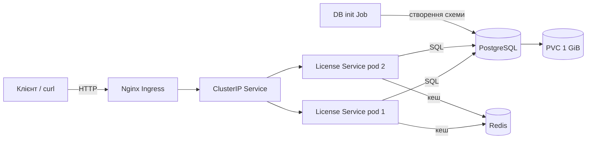

# Лабораторна робота №3 — оркестрація застосунку в Kubernetes

## 1. Мета та об’єкт розгортання

Метою роботи є перенесення контейнеризованого сервісу з Docker Compose до
Kubernetes, опис його інфраструктури декларативними маніфестами та перевірка
основних механізмів оркестрації: самовідновлення, горизонтального масштабування,
поступового оновлення, відкату й діагностики помилок.

Як приклад використано License Service платформи MTG MODS. У Kubernetes
розгортаються такі компоненти:

- два взаємозамінні екземпляри FastAPI-сервісу;
- PostgreSQL як основне сховище бізнес-даних;
- Redis як спільний кеш публічної статистики;
- Job для детермінованої ініціалізації схеми бази даних;
- Service та Nginx Ingress для мережевого доступу до API.

Для застосунку використано незмінний образ із GHCR, сформований CI-процесом у
лабораторній роботі №2. Тег образу містить SHA коміту, тому версію розгортання
можна однозначно відтворити.

## 2. Підготовка середовища

Локальний кластер створюється Minikube з Docker-драйвером. Додатково вмикаються
`metrics-server` для отримання метрик ресурсів і `ingress` для маршрутизації
HTTP-трафіку.

```powershell
minikube start --driver=docker --cpus=4 --memory=6144
minikube addons enable metrics-server
minikube addons enable ingress
kubectl wait --namespace ingress-nginx --for=condition=available deployment/ingress-nginx-controller --timeout=180s
kubectl get nodes
kubectl get pods -n kube-system
```

Усі об’єкти роботи ізольовано в namespace `mtgmods-labs`. Це відокремлює
навчальне розгортання від системних компонентів кластера та інших застосунків.

## 3. Структура Kubernetes-маніфестів

Маніфести розташовано в каталозі [`k8s`](../k8s/). Кожен ресурс описаний в
окремому файлі, а [`kustomization.yaml`](../k8s/kustomization.yaml) об’єднує їх
у єдиний набір, що застосовується однією командою.

| Об’єкт | Реалізація та призначення |
|---|---|
| `Namespace/mtgmods-labs` | логічна ізоляція всіх ресурсів лабораторної роботи |
| `Deployment/license-service` | два екземпляри API, стратегія `RollingUpdate`, probes та обмеження ресурсів |
| `Service/license-service` | стабільна ClusterIP-адреса та балансування запитів між pod’ами API |
| `Ingress/license-service` | вхідна HTTP-точка `http://mtgmods.local` через Nginx Ingress Controller |
| `Deployment/license-postgres` | екземпляр PostgreSQL із постійним диском |
| `PersistentVolumeClaim/license-postgres-data` | запит 1 GiB дискового простору для збереження даних між перезапусками |
| `Deployment/redis` | спільний відновлюваний кеш статистики для всіх API-екземплярів |
| `Job/license-db-init` | створення таблиць до початку обробки бізнес-запитів |
| `ConfigMap/license-config` | нечутливі параметри застосунку |
| `Secret/license-secrets` | локальні навчальні облікові дані та рядки підключення |

Значення в `Secret` є демонстраційними й діють лише всередині локального
Minikube. Реальні виробничі секрети в репозиторії не зберігаються.

## 4. Архітектура розгортання

Вихідний код схеми збережено у
[`architecture-kubernetes.mmd`](architecture-kubernetes.mmd).



`Service` не залежить від конкретних імен pod’ів: він вибирає готові екземпляри
за labels. Завдяки цьому заміна або масштабування pod’ів не змінює адресу, за
якою Ingress звертається до застосунку.

PostgreSQL містить критичний бізнес-стан і використовує PVC. Redis зберігає лише
відновлюваний кеш, тому постійний том для нього не потрібний.

## 5. Конфігурація Deployment

`Deployment/license-service` має `replicas: 2`. Для контейнера визначено:

- `readinessProbe` на `/health`, яка перевіряє також доступність PostgreSQL;
- `livenessProbe` на `/health/live`, яка визначає працездатність процесу;
- CPU request `100m` і limit `500m`;
- memory request `128Mi` і limit `512Mi`;
- `maxUnavailable: 0` і `maxSurge: 1` для оновлення без зупинки сервісу;
- `INSTANCE_ID`, сформований з імені pod’а через Kubernetes Downward API.

Поки `readinessProbe` не проходить, pod не включається до endpoints сервісу й не
отримує користувацькі запити. `X-Instance-ID` у відповіді дозволяє визначити,
який саме екземпляр обробив запит.

## 6. Декларативне розгортання

Увесь стек створюється однією командою:

```powershell
kubectl apply -k k8s
kubectl wait --for=condition=complete job/license-db-init -n mtgmods-labs --timeout=180s
kubectl rollout status deployment/license-service -n mtgmods-labs --timeout=180s
```

Init-контейнер License Service очікує появи таблиці `licenses`. Тому API не
переходить у стан Ready раніше, ніж Job завершить створення схеми бази даних.

Стан створених ресурсів і фактичне споживання ресурсів перевіряються командами:

```powershell
kubectl get pods,deployments,replicasets,services,ingresses,pvc -n mtgmods-labs
kubectl describe deployment license-service -n mtgmods-labs
kubectl top pods -n mtgmods-labs
```

Після холодного розгортання отримано два Ready API-pod’и, Ready PostgreSQL і
Redis, завершений Job та PVC у стані Bound.

## 7. Перевірка мережевого доступу

У Windows із Docker Desktop доступ до Ingress забезпечує процес
`minikube tunnel`. Запит до `/health` виконується без зміни системного hosts-файлу:

```powershell
minikube tunnel
curl.exe --resolve "mtgmods.local:80:127.0.0.1" http://mtgmods.local/health
```

Отримана відповідь мала статус HTTP 200, стан `UP`, інформацію про доступність
бази даних і заголовок `X-Instance-ID` з іменем pod’а. OpenAPI/Swagger доступний
за шляхом `http://mtgmods.local/docs`.

## 8. ConfigMap і Secret

`ConfigMap` містить версію застосунку, версію API, URL Redis та прапорці запуску
фонових процесів. `Secret` передає PostgreSQL credentials, JWT secret та внутрішні
токени через змінні середовища.

```powershell
kubectl get configmap license-config -n mtgmods-labs -o yaml
kubectl exec -n mtgmods-labs deploy/license-service -- printenv APP_VERSION REDIS_URL
kubectl exec -n mtgmods-labs deploy/license-service -- python -c "import os; print('JWT secret injected:', bool(os.getenv('JWT_SECRET')))"
```

Перевірка показала, що значення ConfigMap доступні контейнеру, а Secret
ін’єктований. Значення самого секрету при цьому не виводиться.

## 9. Самовідновлення та масштабування

Для перевірки self-healing один із pod’ів API видаляється вручну:

```powershell
$pod = kubectl get pod -n mtgmods-labs -l app=license-service -o jsonpath='{.items[0].metadata.name}'
kubectl delete pod $pod -n mtgmods-labs
kubectl get pods -n mtgmods-labs -l app=license-service --watch
```

ReplicaSet виявив відхилення фактичного стану від `replicas: 2`, створив новий
pod і повернув Deployment до двох Ready-екземплярів.

Горизонтальне масштабування перевірено зміною кількості реплік з двох до трьох і
назад:

```powershell
kubectl scale deployment/license-service -n mtgmods-labs --replicas=3
kubectl rollout status deployment/license-service -n mtgmods-labs
kubectl get pods -n mtgmods-labs -l app=license-service
kubectl scale deployment/license-service -n mtgmods-labs --replicas=2
```

Проміжний стан Deployment становив `3/3 Ready`, після чого було відновлено
декларативну базову конфігурацію з двома репліками.

## 10. Rolling Update та rollback

Початковий образ:

`ghcr.io/mtgmods/labs-license-management-platform-license:sha-805ca0af230d9ece135982527f3c69ba6ca231b0`

Оновлення виконано до другої незмінної версії:

```powershell
./scripts/devops-lab3/watch-availability.ps1 -Requests 60

kubectl set image deployment/license-service -n mtgmods-labs license-service=ghcr.io/mtgmods/labs-license-management-platform-license:sha-f83b4c7cf2a84fb90200932522f24aad9ebe31df
kubectl rollout status deployment/license-service -n mtgmods-labs --timeout=180s
kubectl rollout history deployment/license-service -n mtgmods-labs
```

Під час Rolling Update Kubernetes створював pod нової версії, чекав проходження
readiness-перевірки й лише після цього видаляв старий. Скрипт доступності весь час
отримував HTTP 200 і зафіксував відповіді від pod’ів обох ReplicaSet.

Відкат виконано до попередньої ревізії:

```powershell
kubectl rollout undo deployment/license-service -n mtgmods-labs
kubectl rollout status deployment/license-service -n mtgmods-labs
kubectl get deployment/license-service -n mtgmods-labs -o jsonpath='{.spec.template.spec.containers[0].image}'
```

Після rollback Deployment знову використовував початковий SHA-тег.

## 11. Моделювання ImagePullBackOff і діагностика

Контрольований збій створено встановленням неіснуючого тега образу:

```powershell
kubectl set image deployment/license-service -n mtgmods-labs license-service=ghcr.io/mtgmods/labs-license-management-platform-license:does-not-exist
kubectl get pods -n mtgmods-labs
$badPod = kubectl get pod -n mtgmods-labs -l app=license-service --sort-by=.metadata.creationTimestamp -o jsonpath='{.items[-1:].metadata.name}'
kubectl describe pod $badPod -n mtgmods-labs
kubectl get events -n mtgmods-labs --sort-by=.lastTimestamp
```

Новий pod перейшов спочатку в `ErrImagePull`, а потім в `ImagePullBackOff`.
`kubectl describe` та Events показали причину: тег `does-not-exist` відсутній у
GHCR. Через `maxUnavailable: 0` дві старі репліки залишилися Ready й сервіс
продовжував відповідати.

Відновлення виконано штатним rollback:

```powershell
kubectl rollout undo deployment/license-service -n mtgmods-labs
kubectl rollout status deployment/license-service -n mtgmods-labs --timeout=180s
kubectl logs -n mtgmods-labs deploy/license-service --tail=20
kubectl exec -n mtgmods-labs deploy/license-service -- python -c "import socket; print(socket.gethostname())"
```

## 12. Видалення середовища

```powershell
kubectl delete -k k8s
minikube stop
```

Видалення namespace видаляє також PVC і локальні лабораторні дані. Команда
`minikube stop` без видалення ресурсів лише зупиняє кластер і зберігає його стан.

## 13. Результати роботи

Повний сценарій виконано 7 жовтня 2026 року з Minikube 1.39.0, Kubernetes 1.37.0
і Docker-драйвером. Експериментально підтверджено:

- відтворюване створення всього стеку командою `kubectl apply -k k8s`;
- роботу двох екземплярів API через спільний Service та Ingress;
- збереження бізнес-стану PostgreSQL на PVC;
- коректну роботу probes і resource requests/limits;
- автоматичне відновлення видаленого pod’а;
- ручне горизонтальне масштабування;
- Rolling Update без HTTP-помилок і штатний rollback;
- діагностику та усунення `ImagePullBackOff` без втрати доступності сервісу.

Отже, застосунок перенесено до Kubernetes, а ключові можливості оркестрації
перевірено на реальному локальному кластері.
